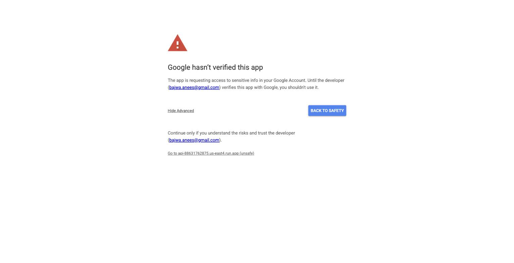

# Unified Search & Safe Send

Search Gmail, Slack and the web from one query, then reply through a gate that
will not let you send twice or send by accident.

**Live: <https://unified-search-1785899621.web.app>** — no account needed.

Two things are the product: a **pluggable adapter layer** where each source runs
as an independent background worker returning one common shape, and a
**safe-send gate** where nothing leaves without an explicit confirmation over
exactly what will be sent. The unified inbox is built on top of them.

---

## Try it

Sign-in is an address, not a password. Three states are one click apart:

| Click | What you get |
|---|---|
| **Sign in** (`console@example.test`) | A throwaway Gmail and a Slack workspace already connected — run a search and watch each source report for itself |
| **Sign in as the seeded demo account** | History and detail in every status: delivered, failed, in-flight, and the amber `uncertain` |
| **Sign in as a brand-new user** | Nothing connected — the real first-run state, with web search still returning results |

You are never asked to connect a personal account, and the same loop runs with
no UI at all — see [Driving it with curl](#driving-it-with-curl).

## Architecture

```
packages/core/   the reusable module: adapters, send gate, jobs, connections
apps/api/        FastAPI — REST, OAuth callbacks, SSE. Stateless.
apps/worker/     same image, different entrypoint. HTTP-driven, not a poll loop.
apps/web/        Vite + React 19 + TypeScript. Talks HTTP only.
```

**Adapters.** One class, one interface, one registry line to add a source:

```python
class SearchAdapter(Protocol):
    source: str
    async def search(self, query: str, ctx: AdapterContext) -> list[Result]: ...
```

One query becomes **one durable job per connection**, so two Gmail accounts run
independently and fail independently. Every adapter returns the same closed
`Result` (`source, id, title, snippet, url`, plus optional `author` and
`timestamp`). The merge layer may not name a source — a test greps it for the
literals `gmail`, `slack` and `web` and fails on any hit.

**The send gate.** There is no route that takes a recipient and a body and
delivers:

```
POST /drafts            → a draft. Inert: no provider call, nothing observable
POST /drafts/{id}/send  → requires confirmed_sha256 over
                          channel ‖ recipient ‖ subject ‖ body
```

Editing a draft changes the digest, so a stale confirmation is refused. Delivery
is draft-then-send, so a crash mid-send is resolved by asking the provider
whether the draft still exists rather than by guessing. When that cannot be
determined the send becomes **`uncertain`** — never `failed` — and is offered two
explicit resolutions instead of a retry.

`packages/core` imports nothing from `apps/` and no web framework, enforced by
import-linter. The console is a pure consumer: every route works with an API key
and there is no browser-session path.

→ **[docs/DESIGN.md](docs/DESIGN.md)** for why each of these is shaped this way,
the failure model, the OAuth design, and the tradeoffs.
→ **[docs/DEMO.md](docs/DEMO.md)** is an illustrated walk-through of the whole
product loop — every screenshot is a real capture from the deployed app.

## Quickstart

Requires Docker (or Colima).

```bash
cp .env.example .env

# Generate the token-encryption key. Required: there is no plaintext fallback
# and no generate-if-missing path, so the app fails closed without it.
python3 -c 'import os,base64;print("TOKEN_KEYRING="+base64.b64encode(os.urandom(32)).decode())' >> .env

docker compose up --build
make seed
```

| | |
|---|---|
| SPA | http://localhost:5173 |
| API | http://localhost:8080/health |
| Worker | http://localhost:8081/health |
| Postgres | `localhost:5433` (not 5432, so a native install is left alone) |

Migrations run as a one-shot `migrate` service before `api` and `worker` start.
With no provider credentials configured, every source reports itself
unconfigured and the web adapter serves fixtures badged `mock` — visible on
every source chip rather than silent.

<details>
<summary><b>Without Docker</b></summary>

```bash
uv sync
docker compose up -d db          # or point DATABASE_URL at any Postgres 17
uv run alembic upgrade head
uv run uvicorn api.main:app --reload --port 8080
cd apps/web && npm install && npm run dev
```

Two processes cannot both own port 8080 — if you run uvicorn on the host, keep
Docker's `api` stopped, or whichever wins the bind silently decides what you are
testing. `pkill -f "uvicorn apps.api.main"` stops the host one reliably.
</details>

<details>
<summary><b>GitHub Codespaces</b></summary>

`.devcontainer/devcontainer.json` provisions Python 3.13, Node 22 and
**docker-in-docker** — required, because the test suite starts its own Postgres
with testcontainers.

```bash
cp .env.example .env
docker compose up -d --wait db migrate
docker compose up -d api worker web
make seed
```

Ports 8080, 8081, 5173 and 5433 forward automatically. The SPA derives its API
host from the page it was served from, so the forwarded URLs work with no
rebuild.

OAuth needs one extra step: Codespaces puts the port in the *hostname*
(`https://<name>-5173.app.github.dev`) and it changes per Codespace, so a live
provider connect requires registering that hostname in both consoles.
Everything else — seed data, web search, the full send gate, the whole test
suite — works without it.
</details>

## OAuth setup

Neither provider is needed to explore the app. This is for connecting real
accounts.

Both require a **public HTTPS redirect URI** — Slack rejects `http://localhost`
outright, so a tunnel is a prerequisite:

```bash
cloudflared tunnel --url http://localhost:8080
# → put the https URL in .env as OAUTH_TUNNEL_URL
```

The quick-tunnel hostname is random per restart and both consoles match it
exactly, so `redirect_uri_mismatch` after a restart means updating
`OAUTH_TUNNEL_URL` **and** both consoles.

**Google.** Cloud console → OAuth consent screen (External) → enable the Gmail
API → Credentials → OAuth client ID (Web application). Redirect URI exactly
`https://<tunnel>/v1/connections/callback/gmail`. Request four scopes and no
more:

| Scope | Why |
|---|---|
| `openid`, `email` | Match a re-grant to the connection it repairs |
| `gmail.readonly` | `gmail.metadata` cannot use `q`, so it cannot search |
| `gmail.compose` | Draft-then-send. Never `gmail.send` — see [DESIGN](docs/DESIGN.md#the-send-gate) |

Publish the app to **In production** (it stays unverified) to remove the 7-day
refresh-token expiry. Unverified apps show an interstitial — **Advanced → Go to
… (unsafe)**:



Then put `GOOGLE_CLIENT_ID` / `GOOGLE_CLIENT_SECRET` in `.env`.

**Slack.** The repo ships [`docs/slack-app-manifest.yaml`](docs/slack-app-manifest.yaml)
— Your Apps → Create New App → From an app manifest, then replace the
placeholder redirect URI. Bot scopes `chat:write`, `chat:write.public`,
`channels:read`, `channels:history`, `channels:join`,
`metadata.message:read`; **user** scope `search:read`. The two-token split is
deliberate and explained in [DESIGN](docs/DESIGN.md#slack-two-tokens-on-purpose).

## Web search

The brief permits "a real search API **or a clearly-labeled mock**". Both are
built: with `WEB_SEARCH_API_KEY` set the adapter calls the Brave Search API, and
unset — the default — it serves a deterministic fixture set and reports
`mode: "mock"`, which the API puts on every source status and the console
renders as a badge.

A mocked source is never allowed to look live. Taking the mock by default keeps
the test suite and Codespaces hermetic with no third-party key, and keeps the
demo deterministic. Setting the key goes live with no other change — the mock is
a fallback inside one adapter, not a separate code path.

## Seed data

```bash
make seed
```

Five searches and seven sends covering **every status the runtime can produce**:
delivered, transiently retrying mid-backoff, permanently failed with a real
provider payload, a revoked grant with a working reconnect link, and an
`uncertain` send with the evidence needed to settle it. So the app is fully
explorable with zero connections.

Re-running replaces the seed rather than duplicating it. Seed rows carry
`is_seed`, every listing reports it, and `?include_seed=false` excludes them, so
seeded data can never be mistaken for something you did. Seed rows never touch a
provider — they are rows. Seeded sends address `TEST_RECIPIENT` (default
`qa@example.test`); `.test` is reserved by RFC 6761 and can never resolve.

## The API

Base `/v1` · `X-API-Key: sk_live_…` on every route except the two marked.
There is no cookie and no browser-session path, so there is nothing the console
can reach that `curl` cannot.

| Method | Path | Purpose |
|---|---|---|
| `POST` | `/auth/dev-login` | Issue an API key (PoC sign-in) — **unauthenticated** |
| `GET` `POST` `DELETE` | `/api-keys[/{id}]` | List by prefix, create (plaintext returned once), revoke |
| `GET` | `/connections` | Status per connection, plus what is connectable |
| `GET` | `/connections/{provider}/authorize` | Begin OAuth. `?reconnect={id}` re-grants in place |
| `GET` | `/connections/callback/{provider}` | OAuth callback — **unauthenticated**; everything trusted is in the signed `state` |
| `DELETE` | `/connections/{id}` | Disconnect. Tokens deleted, history retained |
| `POST` | `/searches` | Fan out — returns before any adapter runs |
| `GET` | `/searches[/{id}]` | History list, or merged results + per-source status. `?debug=1` adds ranking inputs |
| `GET` | `/searches/{id}/results` | Results only, partial-safe |
| `GET` | `/searches/{id}/events` | SSE progress — an accelerator; carries nothing the snapshot lacks |
| `POST` | `/searches/{id}/rerun` | Same query, new search |
| `POST` `GET` `PATCH` | `/drafts[/{id}]` | Create (no external effect), read, edit (invalidates the digest) |
| `POST` | `/drafts/{id}/send` | **The gate.** Idempotent |
| `GET` | `/sends[/{id}]` | History, or detail: attempts, full error text, evidence |
| `POST` | `/sends/{id}/retry` | Operator retry, under the original key |
| `POST` | `/sends/{id}/resolve` | Settle an in-doubt send |

Schema at `/openapi.json`; the console's TypeScript types are generated from it
with `make schema` and never hand-edited.

Listings take `?limit` (≤100), `?cursor` and `?include_seed=false`, newest
first, keyset-paged. Every query filters by the key's owner, and another user's
resource returns **404, never 403** — a 403 would confirm it exists.

Every refusal carries a machine-readable `code` and a `classification`
(`transient` · `permanent` · `needs_reconnect` · `config`) so a client can decide
whether retrying is meaningful without parsing prose:

```jsonc
{ "error": { "code": "connection_needs_reconnect", "classification": "needs_reconnect",
             "message": "Google access was revoked.",
             "action_url": "/v1/connections/gmail/authorize?reconnect=31" } }
```

| Code | HTTP | Class | What to do |
|---|---|---|---|
| `unauthorized` | 401 | permanent | Identical for wrong, revoked, expired and unknown keys — never disclose which |
| `not_found` | 404 | permanent | Also returned for another user's resource |
| `confirmation_required` | 422 | permanent | Send the draft's `confirm_sha256` |
| `body_changed_since_confirmation` | 422 | permanent | Re-read the draft and confirm what it holds now |
| `idempotency_key_body_mismatch` | 422 | permanent | Caller bug: this key was used for different content |
| `resolution_required` | 409 | permanent | An in-doubt send needs a decision, not a retry |
| `connection_needs_reconnect` | 409 | needs_reconnect | A grant existed and was revoked — send the user to `action_url` |
| `connection_not_connected` | 409 | needs_reconnect | Never connected. A distinct verb: offering to *re*connect an account nobody linked reads as though we lost something |
| `recipient_invalid` | 422 | permanent | Do not retry |
| `channel_not_found` | 422 | permanent | Do not retry |
| `provider_rate_limited` | 503 | transient | Auto-retried; `Retry-After` wins over our backoff |
| `provider_unavailable` | 503 | transient | Auto-retried with backoff |
| `invalid_cursor` | 422 | permanent | Drop the cursor, re-read the first page |
| `authorization_denied` | 400 | permanent | The user declined at the consent screen |
| `authorization_incomplete` | 400 | permanent | The callback carried no code — restart the flow |
| `state_invalid` | 400 | permanent | Signed state missing, tampered with, or expired |
| `reconnect_account_mismatch` | 409 | permanent | The re-grant authorized a different account |
| `internal_config_error` | 500 | config | **Our** bug — alert the operator |
| `provider_not_configured` | 503 | config | **Our** bug: no OAuth client for that provider |

The `config` class exists so a rotated client secret never renders as "reconnect
your account", which would send a user in circles repairing a grant that was
never broken.

Codes are declared once in `apps/api/catalog.py`. `tests/test_error_catalog.py`
makes a real request for every one and reads the response — a documented error
code that has never been returned is not an error code — and separately asserts
that this table lists every code the API can return.

### Driving it with curl

The whole loop, no UI process. `make smoke` runs this continuously.

```bash
API=http://localhost:8080
KEY=$(curl -sX POST $API/v1/auth/dev-login -H 'content-type: application/json' \
        -d '{"email":"you@example.test"}' | jq -r .key)
AUTH="X-API-Key: $KEY"

# Fan out. Returns immediately — no adapter has run yet.
SEARCH=$(curl -sX POST $API/v1/searches -H "$AUTH" -H 'content-type: application/json' \
          -d '{"query":"acme renewal"}' | jq -r .search_id)

# Partial results are readable while slow sources are still working.
curl -s "$API/v1/searches/$SEARCH" -H "$AUTH" | jq '{finished, sources}'

# A draft. No provider is contacted.
DRAFT=$(curl -sX POST $API/v1/drafts -H "$AUTH" -H 'content-type: application/json' \
         -d '{"channel":"gmail","to":"qa@example.test","body":"Confirming for Thursday."}')
ID=$(jq -r .draft.id <<<"$DRAFT"); SHA=$(jq -r .confirmation.confirm_sha256 <<<"$DRAFT")

# No digest, no send. The refusal is the product.
curl -sX POST $API/v1/drafts/$ID/send -H "$AUTH" \
     -H 'content-type: application/json' -d '{}' | jq -r .error.code
#   → confirmation_required

# The send, then the exact same call again: one message, same provider_message_id.
curl -sX POST $API/v1/drafts/$ID/send -H "$AUTH" \
     -H 'content-type: application/json' -d "{\"confirmed_sha256\":\"$SHA\"}" | jq
curl -isX POST $API/v1/drafts/$ID/send -H "$AUTH" \
     -H 'content-type: application/json' -d "{\"confirmed_sha256\":\"$SHA\"}" \
  | grep -i 'idempotent-replayed'
#   → Idempotent-Replayed: true
```

## Checks

```bash
make test        # full suite against a throwaway Postgres 17
make headline    # just the graded behaviours (11 tests, ~17s)
make lint        # ruff + import-linter module boundaries
make typecheck   # mypy --strict
make web         # the console: tsc, oxlint, unit tests
make smoke       # the loop above, end to end, no UI running
make image       # cross-build linux/amd64 and prove both entrypoints serve
```

CI runs all of these on every push (`.github/workflows/ci.yml`).

`make headline` covers the behaviours worth looking at first — marked in place
rather than moved into one file, so each stays beside the machinery it tests:

| What it proves | Where |
|---|---|
| **Exactly-once send** under a duplicate key — concurrently with real OS threads released by a barrier, and across a crash injected at every seam between dispatch and record | `test_send_gate.py`, `test_send_crash.py` |
| **A slow adapter does not block fast ones** — over a real socket, because `TestClient` and `ASGITransport` both buffer the whole response and so cannot detect blocking at all | `test_partial_results.py` |
| **Every result conforms to the closed shape**, asserted at the wire | `test_adapters.py` |
| **A revoked grant surfaces as reconnect** and survives one — same connection id, and the search that failed then succeeds | `test_connections.py` |
| **Transient retries with backoff, permanent does not** | `test_job_runtime.py` |
| **History fidelity** — attempts, untruncated error, and an operator retry that resumes the record | `test_api_e2e.py` |

The suite is hermetic: no third-party key, no network.
`tests/test_hermetic.py` asserts that rather than claiming it — including that
**no default source is registered `live`**, because adapters register at module
import, so a machine with a populated `.env` could otherwise reach real
providers while CI stayed green.

Enable the secret-scanning hook once per clone — it fails closed if gitleaks is
missing, rather than leaving changes unscanned:

```bash
git config core.hooksPath .githooks && brew install gitleaks
```

## Deployment

| | |
|---|---|
| SPA | Firebase Hosting (Spark) |
| API | Cloud Run `us-east4`, public |
| Worker | Cloud Run, **private** (`--no-allow-unauthenticated`) |
| Database | Neon `aws-us-east-1`, pooled endpoint, PG 17 |
| Hot path | Cloud Tasks — the API nudges the worker after each job-creating commit |
| Sweep | Cloud Scheduler `*/15` → recovers stale leases, then drains due jobs |
| Secrets | Secret Manager; the token keyring is a **file mount**, not an env var |

`scripts/deploy/bootstrap-gcp.sh` does one-time project setup and
`scripts/deploy/deploy.sh` builds, pushes and deploys both services. Register
the OAuth redirect URIs against the API URL afterwards — exact match, no
trailing slash.

Everything runs inside free tiers. The $0 posture in order of load-bearing: a
**Free Trial billing account, never upgraded** (auto-closes at $300/90 days with
no auto-conversion — the only mathematical guarantee); a **$1 enforced spend
cap** on Cloud Run plus a gross-cost alert; `--max-instances=2` everywhere (the
default is 100); `--min-instances=0` with request-based billing; only five APIs
enabled and never `containerscanning` ($0.26 per push); images cross-built
locally rather than via `gcloud run deploy --source`; the sweep hits a Cloud Run
*service*, never a Job, which bills a one-minute minimum per execution.

## Known limitations

Stated rather than discovered — reasoning in [DESIGN](docs/DESIGN.md#tradeoffs-and-what-i-would-change).

- **Sign-in is an address with no password.** Anyone who knows an address can
  act as that user, so no real personal grant may be left connected on a public
  instance — the deployed one carries throwaway accounts only. Production would
  put an identity provider in front of key issuance.
- **The API key lives in `sessionStorage`**, which is XSS-reachable. Accepted so
  there is exactly one credential path.
- **`uncertain` is a real state.** Exactly-once delivery to a provider with no
  idempotency key reduces to the Two Generals problem; we guarantee exactly-once
  *effect* and expose the residue rather than guessing.
- **Ranking is deliberately simple** — scores from Gmail, Slack and a web API are
  not comparable, so a unified score would be invented. Inputs are inspectable
  under `?debug=1`.
- **Slack message bodies are cached with a TTL, not archived**; identifiers and
  permalinks persist. The app stays undistributed.
- **The web adapter is a labelled mock by default** (the live path exists).
- **No Playwright yet.** The console has unit tests and a Python boundary test;
  the end-to-end confirm flow is still held by hand verification.
