# Demo run-through

Every screenshot below is a real capture from the deployed app, taken by walking
this exact path. Follow it top to bottom and you have the recording.

**Format:** each step gives you the screen, then **Do** (the action) and **Say**
(the point). Anything in *italics* is speakable as written — but say it in your
own words; a read-aloud script sounds like one.

**Budget:** the brief asks for 15–30 minutes. This runs ~29 with everything, and
the [Timing](#timing) table at the end marks what to cut if you are long.

- **App** — <https://unified-search-1785899621.web.app>
- **API** — `https://api-88631762875.us-east4.run.app`
- **Repo** — <https://github.com/AneesBajwa/unified-search-safe-send>

---

## Before you hit record

**1 · Reset the seed** so history reads cleanly and the `uncertain` row is back:

```bash
DATABASE_URL='<neon-pooled-url>' uv run python scripts/seed.py
```

**2 · Turn on the slow source.** The partial-results segment is the single best
moment in part one and it does not exist without this. It is off in normal
operation so reviewers are not slowed:

```bash
gcloud run services update worker --region=us-east4 \
  --update-env-vars=SLOW_ADAPTER_SOURCE=slack,SLOW_ADAPTER_DELAY_MS=8000
```

**Turn it off when you finish:**

```bash
gcloud run services update worker --region=us-east4 \
  --remove-env-vars=SLOW_ADAPTER_SOURCE,SLOW_ADAPTER_DELAY_MS
```

**3 · Have these open**, in this tab order, so you never hunt mid-sentence:

| Tab | For |
|---|---|
| The app, **signed out** | Part one |
| A terminal in the repo | The `curl` segment and the grant-invalidation |
| `docs/DESIGN.md` | Part two, if you want the diagrams in view |
| The Slack sandbox (`#social`) | Optional second witness for a send |

**4 · Rehearse the two irreversible bits once**, then re-seed:
resolving the `uncertain` row consumes it, and invalidating a grant needs a real
Google consent to undo. Both are scripted below; neither is hard, but neither is
something to improvise on camera.

**5 · Know the two recovery moves** — see [If something breaks
live](#if-something-breaks-live). Cloud Run cold-starts, so if the very first
request is slow, that is a scale-to-zero cold start and it is worth saying so
out loud rather than waiting in silence.

---

# Part one — the working system

## 1 · What a stranger sees first

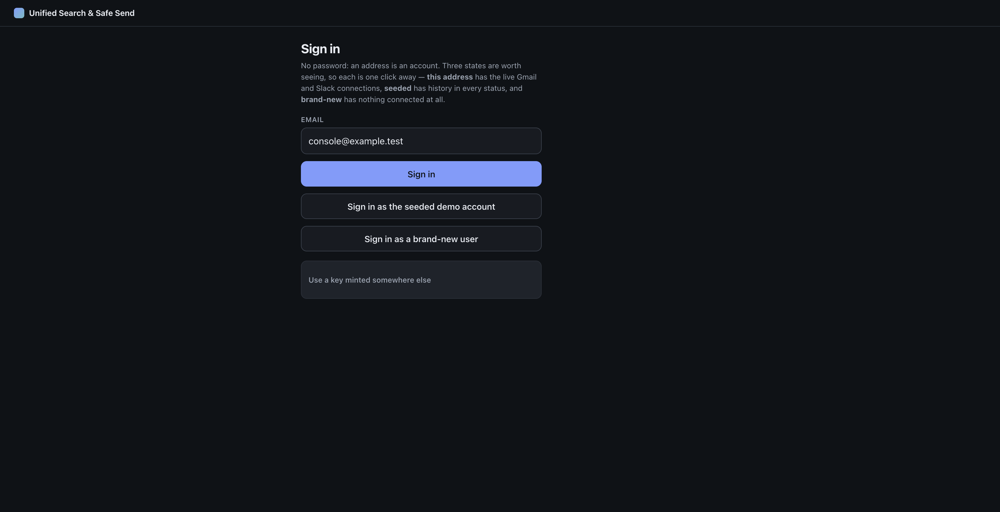

**Do:** Land on the app signed out. Read the three options, then click **Sign in
as a brand-new user**.

**Say:** *"Sign-in is an address, not a password. That is a deliberate trade for a
proof of concept and I will come back to what it costs. Three states are worth
seeing, so each is one click — and I want to start where a reviewer starts, with
an account that has nothing connected at all."*

---

## 2 · A brand-new user searches before connecting anything

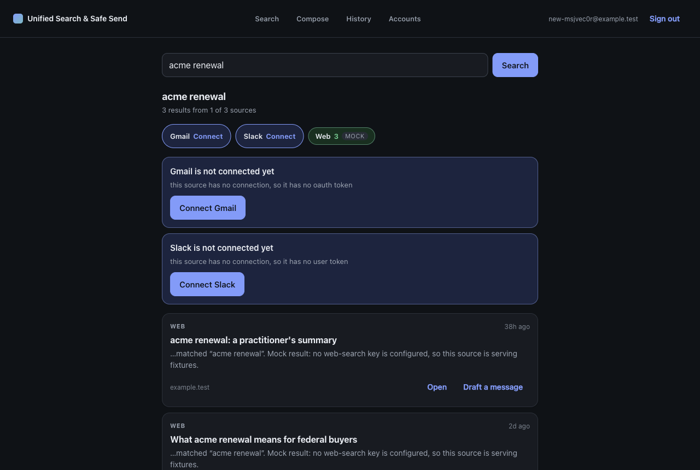

**Do:** The query box is pre-filled. Click **Search**.

**Say:** *"Nothing is connected. Notice what this is not. It is not a red failure,
and it does not say 'reconnect' for an account nobody ever linked — both
providers offer an inline **Connect**, right where the gap is. Meanwhile the web
source needs no grant at all, so the product does something useful in the first
five seconds."*

*"Look at the header too: **one of three sources** contributed. It does not
credit sources that returned nothing. That distinction — never connected, needs
reconnecting, connected but nothing matched, and genuinely failed — runs through
the entire system, and each one renders differently."*

> **If asked "why does that matter?"** — because the failure mode of a unified
> inbox is a silently missing source. If a source that could not be reached looks
> the same as a source with nothing in it, the user concludes "nobody emailed me
> about this" when we never actually looked.

---

## 3 · Connections

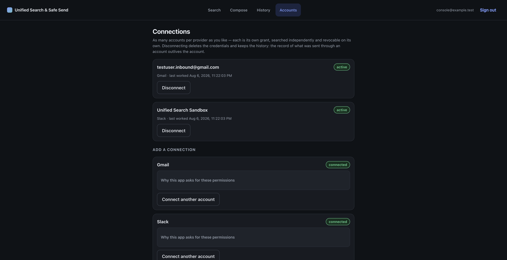

**Do:** Sign out, sign in with the default `console@example.test`, open
**Accounts**.

**Say:** *"This account has a throwaway Gmail and a Slack workspace. Each is its
own OAuth grant, scoped narrowly — four Gmail scopes and no more, and
`gmail.compose` rather than `gmail.send`, which I will explain when we send
something."*

*"Note **Connect another account**. Multiple accounts per provider is a
first-class case, not a limit I am working around: each grant is searched
independently, fails independently, and reconnects independently. That was
actually broken until late — the fan-out kept only the last grant per provider,
so a second Gmail account was silently never searched, behind one healthy-looking
chip. Every test used one account per provider, so nothing caught it."*

---

## 4 · One query, three sources, and a slow one that blocks nothing

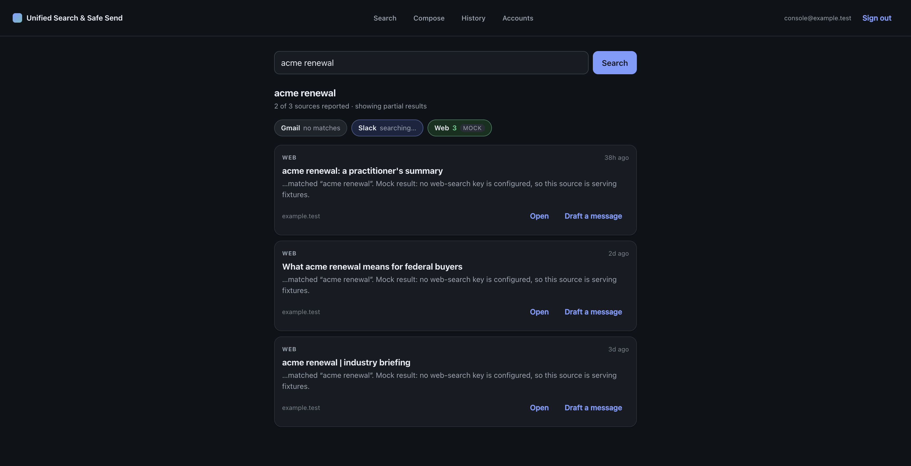

**Do:** Go to **Search**, query `acme renewal`, click **Search**. **Stay on this
screen** while Slack is still working. This is the moment to pause on.

**Say:** *"Slack is artificially delayed by eight seconds. Read the header: **two
of three sources reported, showing partial results**. Gmail says 'no matches' —
completed, nothing there, which is different from a failure. Slack says
**searching**. And the web results are already on screen and usable."*

*"Nothing is waiting for the slowest source. Each source is an independent
durable job that writes its own results and its own terminal status in its own
transaction, which is what makes this readable mid-flight instead of a spinner
over the whole page."*

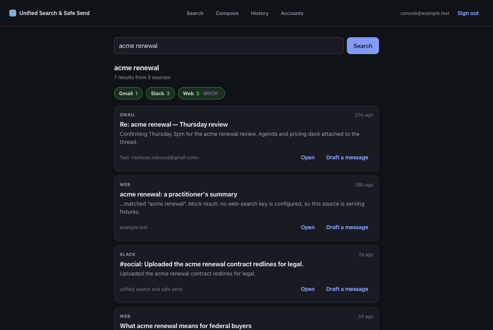

**Do:** Wait for Slack to land.

**Say:** *"It merges into one ranked list. Every result has the same closed shape
whatever its source — source, id, title, snippet, url, with author and timestamp
optional and nothing else. The merge layer literally cannot name a source: there
is a test that greps it for the words 'gmail', 'slack' and 'web', comments
included, and fails on a hit. Adding a fourth source is one adapter file and one
registry line."*

> **If asked about ranking** — within-source reciprocal rank blended with recency
> decay, plus a per-source cap. Deliberately simple, because relevance scores from
> Gmail, Slack and a web API are not comparable, so any unified score would be
> invented. The inputs are inspectable under `?debug=1` rather than hidden behind
> a number that looks authoritative.

---

## 5 · Compose, and the gate

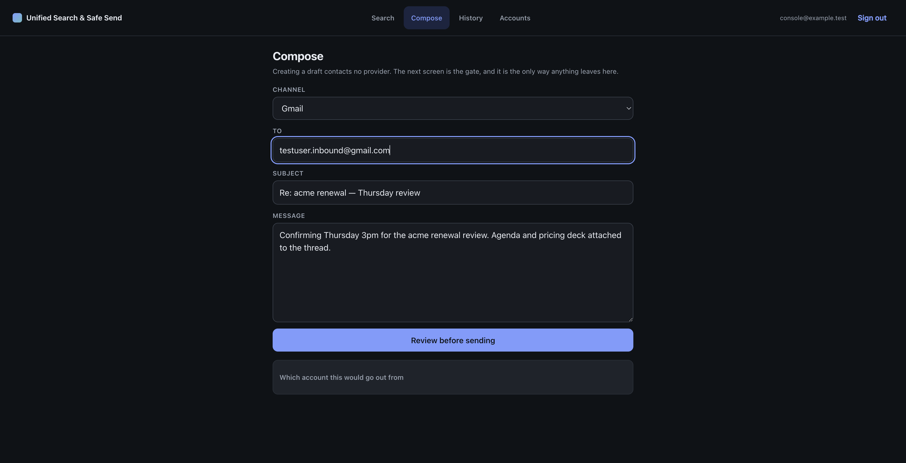

**Do:** Click **Draft a message** on a result, or open **Compose**. Fill in
recipient, subject and body.

**Say:** *"Creating a draft contacts no provider. It is inert — no job, no
external effect, nothing observable from outside this system. The next screen is
the only way anything leaves."*

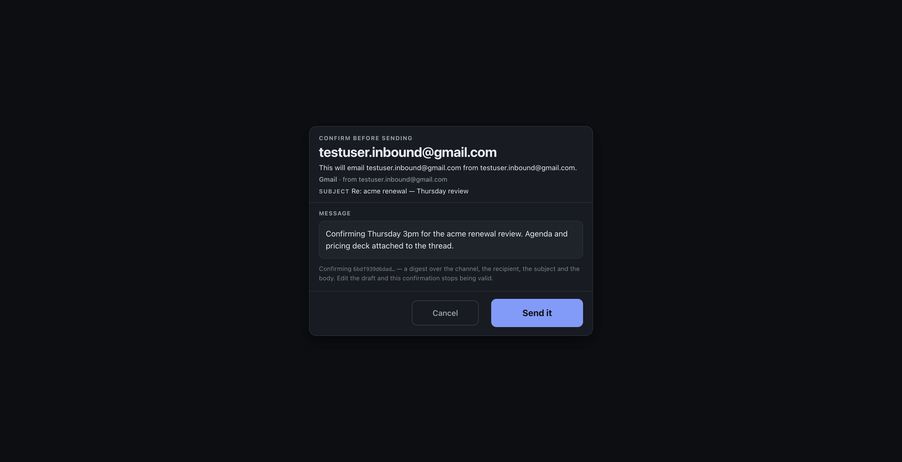

**Do:** Click **Review before sending**. Pause.

**Say:** *"This is the gate. It names the recipient, it names **which account it
goes out from** — which matters the moment you have two — and it shows the exact
body. The confirmation is a SHA-256 over channel, recipient, subject and body. Go
back and change one character and this confirmation stops being valid; the send
is refused by name. That is arithmetic, not bookkeeping that could drift."*

*"And there is no route anywhere in the API that takes a recipient and a body and
delivers. Not a hidden one, not an admin one. The absence is the feature."*

---

## 6 · Double-tap the confirm button

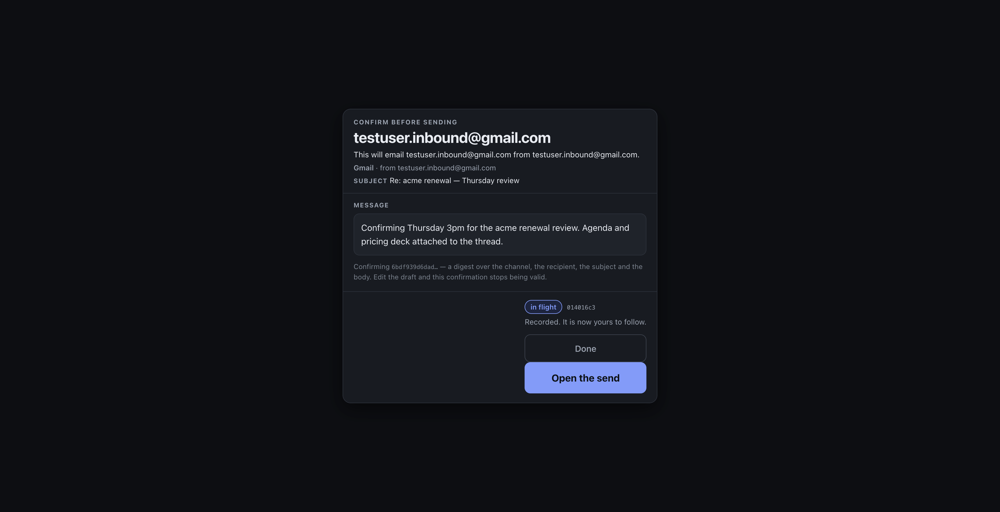

**Do:** Click **Send it** twice, as fast as you can. Then **Open the send**.

**Say:** *"I clicked that twice. One send."*

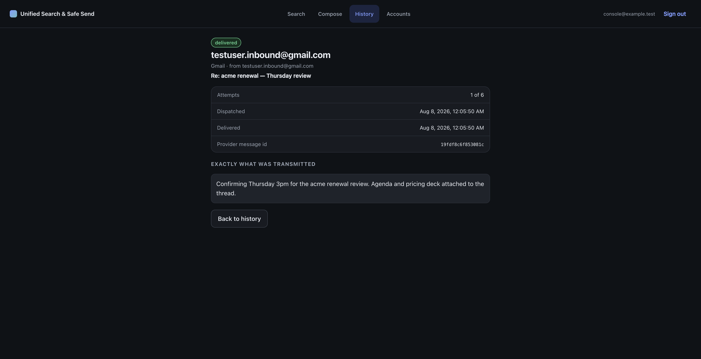

**Say:** *"Delivered, **attempt one of six**, the provider's own message id, and
the exact text transmitted. Not two attempts that got deduplicated afterwards —
one attempt. The draft carries an idempotency key and the gate claims it before
anything else happens."*

### Prove it at the provider, not on our own status page


**Do:** Search for the subject you just used.

**Say:** *"My status page saying 'delivered' proves nothing about how many
messages the provider actually received. So here is the recipient's mailbox,
through the product: **Gmail, one**. Two clicks, one message — and now all three
sources are contributing, because the message I just sent is genuinely there."*

> **If asked "what about a network blip rather than a double-click?"** — same
> mechanism, and I will show it over `curl` at the end: the identical request
> returns 200 with `Idempotent-Replayed: true` and the same
> `provider_message_id`, rather than 409. A retried request that already
> succeeded is not a client error.

---

## 7 · Break a grant, then repair it in one click

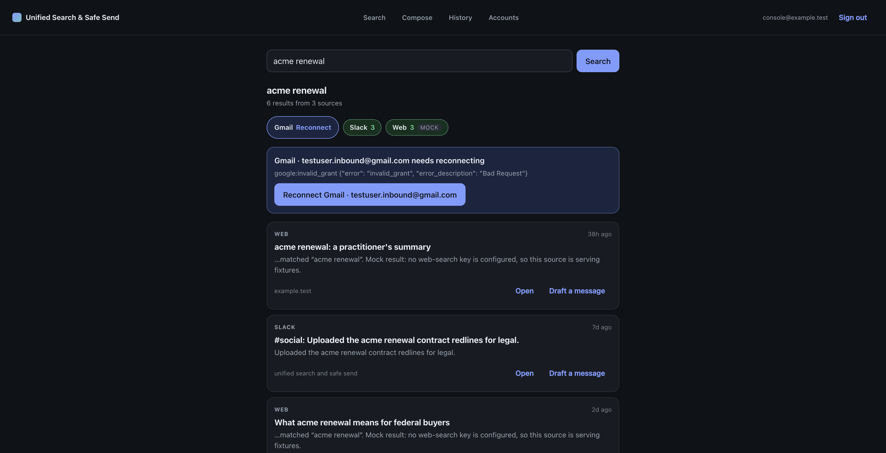

**Do:** Invalidate the stored token, then re-run the search:

```bash
DATABASE_URL='<neon-pooled-url>' TOKEN_KEYRING='<keyring>' \
  uv run python -c "
import asyncio
from core.connections.service import invalidate_stored_token
asyncio.run(invalidate_stored_token(5))"
```

**Say:** *"I have replaced the stored refresh token with a well-formed but dead
one. Deliberately not a corrupt ciphertext — a corrupt envelope is **my** bug and
classifies differently. This is what a revoked grant looks like, and Google
returns `invalid_grant`."*

*"The result is a distinct **needs reconnecting** state carrying the real provider
payload, not a generic failure. Two things matter. The fix is offered exactly
where the failure appeared. And **Slack and web are completely unaffected** — one
dead grant does not break the search."*

**Do:** Click **Reconnect Gmail · testuser.inbound@gmail.com** and complete the
Google consent — **Advanced → Go to … (unsafe)**, because the app is published
but unverified.

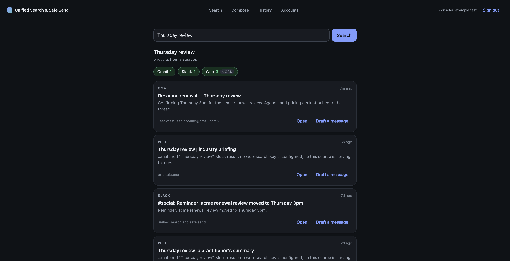

**Say:** *"Same connection id — five, before and after. That matters more than it
looks: drafts, sends and every historical adapter run reference that row, so a
reconnect that created a new connection would orphan all of it. The re-grant is
matched by the provider's stable subject id, and authorizing a **different**
account against a reconnect is refused by name rather than silently overwriting
the first. And the search that just failed now succeeds."*

> **If asked "why not treat any 401 as revoked?"** — because it usually is not.
> An expired access token returns 401 constantly and is completely normal. Only
> `invalid_grant` from the refresh endpoint means the grant is dead. Escalating
> every 401 would disconnect healthy users all day.

---

## 8 · History, and the failures worth keeping

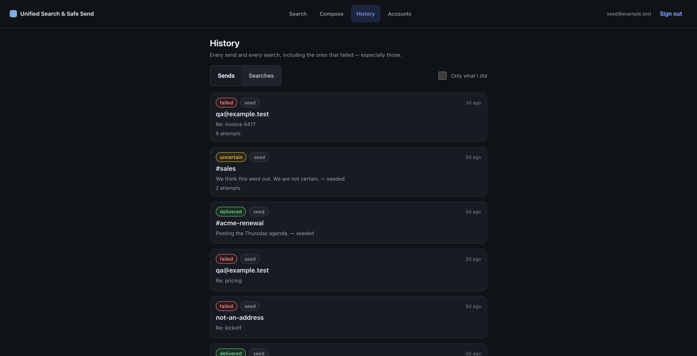

**Do:** Sign in as the seeded account and open **History**. Toggle to
**Searches** and back.

**Say:** *"Every send and every search is recorded, including — especially — the
ones that failed. Everything here is badged **seed** so synthetic data can never
be mistaken for something you did, and there is a filter to exclude it entirely.
This covers every status the runtime can actually produce, which is the point: a
reviewer with nothing connected can still see the whole state machine."*

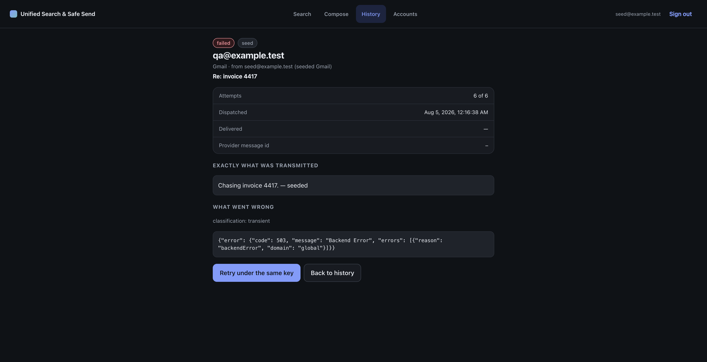

**Do:** Open a failed send.

**Say:** *"Attempt count, the **untruncated** provider error — the actual Gmail
503 JSON, not my summary of it — and an operator retry that resumes this record
rather than starting a fresh one, so the history reads 'six automatic attempts,
then a person tried again'."*

*"Transient failures like this retry themselves with full-jitter backoff, and a
provider's `Retry-After` always wins over my computed delay. A permanent failure
— invalid recipient, revoked auth, quota exhausted — is surfaced immediately with
a distinct reason and never auto-retried, because that is an operator's decision.
There is a fourth class too, `config`, for **my** misconfiguration, so a rotated
client secret never renders as 'reconnect your account' and send a user in
circles repairing a grant that was never broken."*

---

## 9 · The state I am proudest of

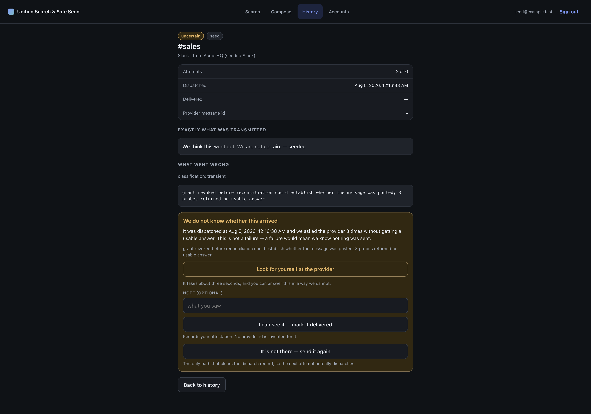

**Do:** Open the `uncertain` send. Slow down here — this is the segment that
shows judgment rather than features.

**Say:** *"We dispatched, and then we could not find out what happened.
Exactly-once delivery to a provider with no idempotency key is **impossible** —
it reduces to the Two Generals problem. So what I guarantee is exactly-once
*effect*, and where the effect genuinely cannot be determined I expose the
residue instead of guessing."*

*"Notice there is no retry button. Re-sending a message that may already have
arrived is the exact misfire this product exists to prevent. Instead there are
two honest resolutions, and the evidence needed to choose between them: when we
dispatched, how many times we probed, and a link into the user's own mailbox."*

*"A system that says 'failed' when it means 'I don't know' is lying to you."*

### Both resolutions work — on camera, click only the first one

**Do:** Click **"I can see it — mark it delivered"**. Talk through the other one
rather than clicking it.

- **"I can see it — mark it delivered"** records an operator attestation. The
  provider id becomes `operator-attested`, because a person's word and a
  provider's receipt are different claims, and that difference is the entire
  content of this state. Safe to demo: it touches no provider.
- **"It is not there — send it again"** clears `dispatched_at`, which is what
  makes the next attempt *dispatch* instead of reconcile. Describe it; do not
  click it live.

> 🛑 **Why not click it on camera.** `forced_resend` takes the operator at their
> word. If the message *did* actually arrive and you say it did not, the system
> obediently sends a second one — and you have just produced a visible duplicate
> in the middle of a demo whose headline claim is that it never double-sends.
>
> I did exactly this while testing and put two copies in the Slack sandbox. The
> system was correct; my premise was false. The distinction is worth stating
> plainly: **the machinery never sends twice on its own — not under a double-tap,
> a retried request, or a crash at any commit seam. What it cannot do is overrule
> a human who asserts the first one never arrived.** That is not a hole, it is
> the only sane escape hatch, which is why the button is worded as a statement of
> fact — "It is not there" — rather than as a retry, and why `uncertain` is never
> offered a plain retry at all.
>
> If you do want to show it landing, use the **seeded** `uncertain` row: it hangs
> off a placeholder connection with no token, so the resend is attempted and
> fails honestly without touching a real provider.

> 🔴 **Worth saying out loud, if you are comfortable:** the forced-resend path was
> broken until I wrote this run-through. A send reaches `uncertain` because
> reconciliation parks it and the job then finishes *successfully* — so the
> operator-retry query, which only resumes `parked` or `failed` jobs, matched
> nothing. Its result was taken on trust, the send went to `in_flight` with no job
> behind it, and nothing recovered it: the sweeper reclaims expired leases, and a
> finished job has no lease. It stranded silently, for ever. The test asserted the
> state the endpoint returned, which was `in_flight` and perfectly true. What
> caught it was asking whether anything was actually scheduled.

⚠️ Resolving the row consumes it. Re-run `make seed` to restore it.

---

## 10 · Mobile

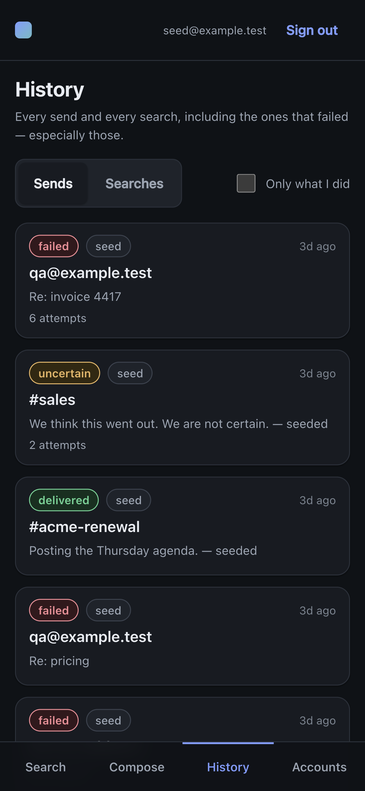
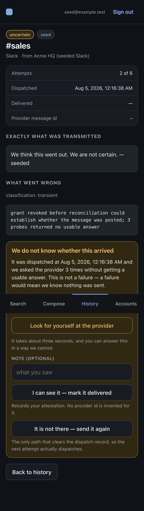

**Do:** Open the same screens at phone width, or on an actual phone.

**Say:** *"Every surface is mobile-first rather than merely responsive. The
navigation becomes a bottom tab bar in thumb reach, and the confirm screen keeps
its actions pinned at the bottom — the dangerous button is never somewhere you
hit by accident reaching for something else."*

---

## 11 · The whole loop with no UI at all

**Do:** Switch to the terminal and run this live.

```bash
API=https://api-88631762875.us-east4.run.app
KEY=$(curl -sX POST $API/v1/auth/dev-login -H 'content-type: application/json' \
        -d '{"email":"console@example.test"}' | jq -r .key)
AUTH="X-API-Key: $KEY"

DRAFT=$(curl -sX POST $API/v1/drafts -H "$AUTH" -H 'content-type: application/json' \
  -d '{"channel":"slack","to":"#social","body":"Posted from curl with no UI running."}')
ID=$(jq -r .draft.id <<<"$DRAFT"); SHA=$(jq -r .confirmation.confirm_sha256 <<<"$DRAFT")

# 1 — no digest, no send
curl -sX POST $API/v1/drafts/$ID/send -H "$AUTH" -d '{}' | jq -r .error.code

# 2 — with the digest
curl -isX POST $API/v1/drafts/$ID/send -H "$AUTH" -H 'content-type: application/json' \
  -d "{\"confirmed_sha256\":\"$SHA\"}" | grep -iE 'HTTP|idempotent'

# 3 — the identical call again
curl -isX POST $API/v1/drafts/$ID/send -H "$AUTH" -H 'content-type: application/json' \
  -d "{\"confirmed_sha256\":\"$SHA\"}" | grep -iE 'HTTP|idempotent'
```

Real output from this run:

```
1 → confirmation_required

2 → HTTP/2 201
     idempotent-replayed: false

3 → HTTP/2 200
     idempotent-replayed: true
     same send_id, provider_message_id C0BM77XUEBX:1786162590.716339
```

**Say:** *"No UI process is running. The console is a pure consumer — every route
it uses is API-key authenticated, there is no cookie and no browser-session path,
so there is nothing the console can reach that a script cannot. And the refusal
without a digest holds here too: the gate lives in the module, not in the front
end. That is the property the brief asked for, and it is enforced by a test that
enumerates every route and fails on any that is neither key-guarded nor
allowlisted with a written reason."*

---

# Part two — the architecture

Lead with decisions, not the file tree. Full reasoning in
**[DESIGN.md](DESIGN.md)**; these are the beats worth saying aloud.

### The adapter layer (~2.5 min) → [DESIGN](DESIGN.md#the-adapter-layer)

One protocol. `AdapterContext` carries a **lazy** token getter, a deadline, a
correlation id — and deliberately no database session, so an adapter cannot reach
past its own job.

> *"One durable job **per connection**, not per source. That was wrong until very
> late: the fan-out built a map from provider to connection id and kept the last
> one, so a user with two Gmail accounts had one silently never searched, behind a
> single healthy chip. Every test used one account per provider. The spec said
> 'one run per connection' and the code did not — nobody had read it back."*

> *"The closed `Result` is what lets the merge layer stay source-agnostic. Ranking
> inputs ride the envelope rather than the result, so a consumer can render the
> list without knowing where a row came from."*

### Multi-account OAuth (~3 min) → [DESIGN](DESIGN.md#multi-account-oauth)

> *"Refresh tokens are encrypted with an envelope key **bound to the connection
> row id as AAD**, so ciphertext lifted into another row will not decrypt. The key
> is a mounted file rather than an environment variable — env vars resolve at
> instance start, so rotating one forces a redeploy, and they leak through
> `/proc/self/environ`, debug endpoints and subprocess environments."*

> *"Refresh happens under a Postgres advisory lock, so twenty concurrent adapter
> runs produce one refresh, not twenty racing each other into an invalid-grant
> state."*

> *"And `prompt=consent` is a repair tool, not a default. Google mints a new
> refresh token on every consent and silently evicts the oldest past a hundred per
> account, so forcing it on ordinary logins quietly breaks other installations."*

### The send gate and the crash window (~4 min) — the strongest section → [DESIGN](DESIGN.md#the-send-gate)

> *"Delivery is draft-then-send rather than `messages.send`, because Gmail's draft
> id is a server-side idempotency token whose **existence** is the state machine.
> If the process dies between dispatch and record, I ask Gmail whether the draft
> still exists instead of guessing."*

> *"That also buys the user something. A draft is a visible record in their own
> mailbox, so an in-doubt send becomes something they can settle by looking rather
> than by trusting my status page. That is why the scope is `gmail.compose` and
> never `gmail.send` — I am asking for a *more* awkward permission on purpose."*

> *"Exactly-once is proven two ways a single-threaded test cannot reach:
> concurrent duplicates with real OS threads released by a barrier, and a crash
> injected at **every commit seam** between dispatch and record. The crash is a
> `BaseException` subclass so production `except Exception` handlers cannot
> swallow it — otherwise the test would exercise the error path while claiming to
> exercise the crash path, and pass."*

### The job runtime (~2 min) → [DESIGN](DESIGN.md#the-job-runtime)

> *"Claims use a materialized CTE with `FOR NO KEY UPDATE SKIP LOCKED`. The
> obvious form — `WHERE id IN (SELECT … LIMIT n FOR UPDATE SKIP LOCKED)` — does
> not hold the lock it appears to: the planner pushes the limit inside a nested
> loop and one worker drains the queue. That one took a `EXPLAIN` to see."*

> *"Recovery is a policy registry, not a blanket retry. Adapter runs retry, sends
> reconcile, and any job kind with no registered reconciler is **parked for a
> human** rather than re-run on the assumption it probably did not land. A test
> asserts every kind has an explicit entry, which turns 'we thought about side
> effects' into something checkable."*

### Why the worker is push-driven (~1.5 min) → [DESIGN](DESIGN.md#why-the-worker-is-push-driven)

> *"A resident polling worker on Cloud Run is correct and costs **$44.71 a month**.
> There is no configuration of an always-on process on this platform that is free.
> So work is dispatched rather than discovered — Cloud Tasks on the hot path,
> Cloud Scheduler for the sweep — and it is *lower* latency than the poll it
> replaced, around 100–400 ms on a warm instance."*

> *"The trap: Cloud Run **Jobs** bill a one-minute minimum per execution, so a
> three-second job every minute costs the same as running around the clock. A Cloud
> Run *service* rounds to 100 ms. Same work, twenty times cheaper."*

### Testing philosophy (~1.5 min)

> *"Every defect worth mentioning in this project was found by using the product
> or by reading the spec back against the code — not by the suite. And each one was
> a test asserting the *shape* of a value instead of reading the value that
> crossed the boundary. The partial-results test is the clearest example: over
> `TestClient` or `ASGITransport` it cannot detect blocking at all, because both
> buffer the entire response before returning it. It has to cross a real socket."*

> *"The forced-resend bug I mentioned earlier is the same species, and it is the
> most recent one — the test asserted the state the endpoint returned rather than
> whether any work had been scheduled."*

### Deployment and the $0 posture (~1.5 min) → [README](../README.md#deployment)

> *"API and worker on Cloud Run, SPA on Firebase Hosting, Postgres on Neon, all
> inside free tiers. The guarantee that actually holds is a Free Trial billing
> account that auto-closes rather than converting — everything else is a
> guardrail: a $1 enforced spend cap, max-instances two everywhere because the
> default is a hundred, and only five APIs enabled."*

### Tradeoffs and what I would change (~2 min) → [DESIGN](DESIGN.md#tradeoffs-and-what-i-would-change)

Be direct about the accepted risks — passwordless sign-in, the API key in
`sessionStorage`, the labelled web-search mock, envelope keys in a keyring string
rather than a KMS. Then what comes next, in order: **Playwright over the confirm
flow** first, because two claims are still held by hand verification; then real
identity in front of key issuance, which removes the largest accepted risk.

---

## Closing (~30 s)

> *"The two things I would want judged are the adapter layer and the send gate.
> Both are a standalone module behind a documented API — the console is a pure
> consumer and I ran the whole loop through `curl` with no UI running. And the
> part I would defend hardest is the amber one: a system that says 'failed' when
> it means 'I don't know' is lying to you, and this one does not."*

---

## Questions you will probably be asked

**"Why no Playwright?"** — The console has unit tests on its most dangerous
component and a Python test that greps the SPA for leaked business rules, so the
module boundary is enforced from both sides. The confirm flow end to end is still
hand-verified, and it is the first thing I would add. I would rather say that
than imply coverage I do not have.

**"Is the web search real?"** — Both exist. With `WEB_SEARCH_API_KEY` set the
adapter calls Brave; unset it serves a labelled fixture set and reports
`mode: "mock"`, which the UI badges. The brief permits a clearly-labelled mock,
and taking it keeps the suite and Codespaces hermetic with no third-party key and
the demo deterministic.

**"What happens if two people resolve the same uncertain send?"** — The state
transition is a compare-and-swap scoped to `state = 'uncertain'`, so the second
one changes nothing and the API refuses it by name. The audit row is written
first and unconditionally, so who decided what survives regardless.

**"Doesn't `forced_resend` break your exactly-once claim?"** — No, and the
distinction is the interesting part. The machinery never sends twice on its own:
not under a double-tap, a retried request, or a crash at any commit seam between
dispatch and record. `forced_resend` is a human explicitly asserting "the first
one did not arrive." If that assertion is wrong, a second message goes out —
because no amount of engineering can protect a provider that offers no
idempotency key from an operator stating something untrue. That is exactly why
`uncertain` is never offered a plain retry, why the button is worded as a
statement of fact rather than an action, and why the alternative resolution
records an attestation instead of inventing a provider receipt. I found this the
hard way: I asserted it falsely during testing and produced a duplicate.

**"How would you add a fourth source?"** — One adapter file implementing the
protocol, one line in the registry. The merge layer cannot name a source and
there is a test that enforces it, so nothing else has to change.

**"Why is sign-in passwordless?"** — Deliberate for a reviewable PoC: it makes
"a brand-new user searches before connecting anything" reachable in one field,
and that state hid a real defect for three phases. It also means anyone who knows
an address can act as that user, so no real personal grant may live on a public
instance — the deployed one carries throwaway accounts only. Production puts an
identity provider in front of key issuance.

**"What is the biggest thing you would change?"** — Push-based freshness. Gmail
watch plus Slack Events, so the inbox updates without a query instead of fanning
out on demand every time. Everything is already built around durable per-source
jobs, so it is a new trigger rather than a new architecture.

---

## If something breaks live

**A source hangs.** Say so and keep going — that is the product working. Partial
results render and the chip says which source is outstanding.

**The first request is slow.** Cloud Run scaled to zero; it is a cold start.
Worth naming out loud, because it is a cost decision you made on purpose.

**OAuth fails with `redirect_uri_mismatch`.** Only happens if you are on the
local tunnel rather than the deployed URL — the tunnel hostname is random per
restart. On the deployed app the URI is fixed.

**A send stays `in_flight` longer than expected.** The sweep runs every fifteen
minutes and also drains due jobs, so it will land. To force it immediately:

```bash
curl -sX POST -H "Authorization: Bearer $(gcloud auth print-identity-token)" \
  https://worker-88631762875.us-east4.run.app/sweep | jq
```

**You consumed the `uncertain` row in a rehearsal.** `make seed` restores it, and
re-seeding is idempotent by deletion rather than upsert, so it will not
accumulate duplicates.

---

## Timing

| Segment | Target | Cut if long? |
|---|---|---|
| Sign-in, brand-new user | 2:00 | no |
| Connections | 1:30 | trim |
| Unified search + slow source | 2:30 | **never** |
| Compose → gate | 2:00 | no |
| Double-tap → provider evidence | 2:30 | **never** |
| Revoke → reconnect | 2:30 | no |
| History + failure detail | 2:30 | trim |
| The `uncertain` state | 2:30 | **never** |
| Mobile | 1:00 | cut first |
| `curl`, no UI | 1:30 | trim |
| **Part one** | **~20:00** | |
| Adapters | 2:30 | |
| Multi-account OAuth | 3:00 | |
| Send gate + crash window | 4:00 | **never** |
| Job runtime | 2:00 | cut second |
| Push-driven worker | 1:30 | trim |
| Testing philosophy | 1:30 | trim |
| Deployment / $0 | 1:30 | cut third |
| Tradeoffs and what next | 2:00 | no |
| Closing | 0:30 | no |
| **Part two** | **~18:30** | |

Full run is long for a 30-minute ceiling — take the three marked cuts and trim
the "trim" rows and you land near 27. The four **never** rows are the submission.
